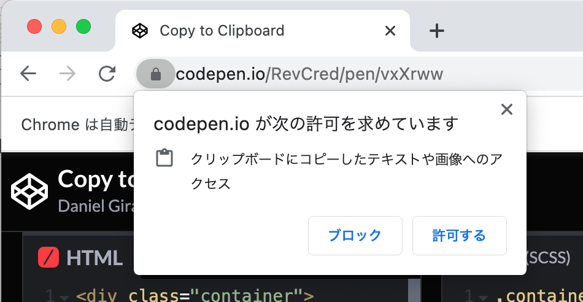

= ChromeDriverFactory

>can go back to https://github.com/kazurayam/chromedriverfactory

chromedriverfactory is a Java/Groovy library that wraps `org.openqa.selenium.webdriver.chrome.ChromeDriver`.
It enables you to launch Chrome browser while specifying a "User Profile", for example "Picasso". And also you can launch Chrome browser while specifying a "Profile Directory Name", for example "Default" or "Profile 1".


== Problem to solve

I want to use a User profile of Chrome browser, I want to save cookies in it.
I want to carry the cookie over into a HTTP session between my selenium test script and
Chrome browser. However it is difficult. Why? Have a look at a quotation from https://chromedriver.chromium.org/capabilities

____
By default, ChromeDriver will create a new temporary profile for each session. At times you may want to set special preferences or just use a custom profile altogether. If the former, you can use the 'chrome.prefs' capability (described later below) to specify preferences that will be applied after Chrome starts. If the latter, you can use the user-data-dir Chrome command-line switch to tell Chrome which profile to use:
____

I want to break this default behavior.
I want to let ChromeDriver to use a profile which was prepared with contents as I wanted.

=== What is "user profile", "user-data-dir" and "profile directory" in Chrome

What is "user profile" in Chrome browser? There are a few articles about it, for example

* https://www.guidingtech.com/things-about-google-chrome-profiles/

== Solution description

I have developed a Java class `com.kazurayam.webdriverfactory.ChromeDriverFactory`.
With it, you can launch Chrome browser with "prepared User profile".

You have an option where to find the profile directory:

1. `UserDataAccess.TO_GO` : ChromeDriverFactory allocates a new temporary directory and in there will create a profile directory. Then ChromeDriverFactory will copy the content of the genuine profile directory into the temporary directory. When you open Chrome with TO_GO option the process will run. However, all of session data saved into this temporary profile directory will be discarded (cookies, cached page resources, etc) when you close the session.
2. `UserDataAccess.FOR_HERE` : ChromeDriverFactory tries to find the profile directory in the Chrome's genuine "user-data-dir". On Mac, it is `/Users/myosusername/Library/Application Support/Google/Chrome/`. A process of Chrome browser demands to lock the genuine profile directory. While a Chrome process is already running, when you try to open another Chrome with FOR_HERE option, the new comer process will fail.


== Sequence diagrams

=== UserDataAccess.TO_GO


=== UserDataAccess.FOR_HERE


== Sample codes

=== Launch Chrome browser without profile specified

Basic case where we launch Chrome browser without profile specified. The example includes how to launch Headless browser. Also includes how to position and resize the browser window.

[source, groovy]
----
include::../src/test/groovy/examples/LaunchChromeWithoutProfile.groovy[]
----

=== Launch Chrome browser with UserProfile specified

[source, groovy]
----
include::../src/test/groovy/examples/LaunchChromeWithUserProfile.groovy[]
----

==== TO_GO

When `UserDataAccess.TO_GO` is specified,
ChromeDriverFactory will let ChromeDriver to generate a commandline to start Chrome browser as follows for example on my Mac:
Please note that the `--user-data-dir` option is given with a temporary directory.

----
/Applications/Google Chrome.app/Contents/MacOS/Google Chrome --allow-pre-commit-input --disable-background-networking --disable-client-side-phishing-detection --disable-default-apps --disable-dev-shm-usage --disable-gpu --disable-hang-monitor --disable-infobars --disable-popup-blocking --disable-prompt-on-repost --disable-sync --disableExtensions --enable-automation --enable-blink-features=ShadowDOMV0 --enable-logging --log-level=0 --no-first-run --no-sandbox --no-service-autorun --password-store=basic --profile-directory=Profile 14 --remote-debugging-port=0 --test-type=webdriver --use-mock-keychain
    --user-data-dir=/var/folders/7m/lm7d6nx51kj0kbtnsskz6r3m0000gn/T/__user-data-dir__7501750884155054730 --window-size=1024,768 --flag-switches-begin --flag-switches-end
----


==== FOR_HERE

When `UserDataAccess.FOR_HERE` is specified,
ChromeDriverFactory will let ChromeDriver to generate a commandline to start Chrome browser as follows for example on my Mac:
Please note that the `--user-data-dir` option is given with a path of "genuine User Data directory", which will be locked by a running Chrome process.

----
/Applications/Google Chrome.app/Contents/MacOS/Google Chrome --allow-pre-commit-input --disable-background-networking --disable-client-side-phishing-detection --disable-default-apps --disable-dev-shm-usage --disable-gpu --disable-hang-monitor --disable-infobars --disable-popup-blocking --disable-prompt-on-repost --disable-sync --disableExtensions --enable-automation --enable-blink-features=ShadowDOMV0 --enable-logging --log-level=0 --no-first-run --no-sandbox --no-service-autorun --password-store=basic --profile-directory=Profile 14 --remote-debugging-port=0 --test-type=webdriver --use-mock-keychain
    --user-data-dir=/Users/kazuakiurayama/Library/Application Support/Google/Chrome --window-size=1024,768 --flag-switches-begin --flag-switches-end
----


==== Caution

Chrome browser is very strict that only 1 process of Chrome can
have access to the "genuine User Data directory". If you have
one Chrome window already opened when you try to launch one more Chrome process with `UserDataAccess.FOR_HERE`,
then that attempt will fail with a message:

[source,shell]
----
targetUserDataDir="/Users/username/Library/Application Support/Google/Chrome"
profileDirectoryName="Profile 14"
org.openqa.selenium.InvalidArgumentException was thrown.
Exception message:

invalid argument: user data directory is already in use, please specify a unique value for --user-data-dir argument, or don't use --user-data-dir
----

As countermeasures you have 2 options.

1. close all Chrome windows before running your test, or
2. your test uses `UserDataAccess.TO_GO` instead


=== Launch Headless Chrome with ProfileDirectoryName specified

[source, groovy]
----
include::../src/test/groovy/examples/LaunchChromeWithProfileDirectory.groovy[]
----

=== print the DesiredCapabilities employed to open a Chrome

[source, groovy]
----
include::../src/test/groovy/examples/PrintEmployedOptions.groovy[]
----

This emits:
----
{
    "acceptSslCerts": true,
    "browserName": "chrome",
    "goog:chromeOptions": {
        "args": [
            "window-size=1024,768",
            "--no-sandbox",
            "disable-infobars",
            "disable-gpu",
            "disable-dev-shm-usage",
            "--incognito"
        ],
        "extensions": [

        ],
        "prefs": {
            "plugins.plugins_disabled": [
                "Adobe Flash Player",
                "Chrome PDF Viewer"
            ],
            "profile.default_content_settings.popups": 0,
            "download.prompt_for_download": false,
            "download.default_directory": "/Users/kazuakiurayama/Downloads"
        }
    }
}
----

=== print UserProfile, ProfileDirectoryName, UserDataDir used to launche a Chrome

[source, groovy]
----
include::../src/test/groovy/examples/PrintWebDriverMetadata.groovy[]
----

This emits
----
ChromeUserProfile : {
    "userProfile": "kazurayam",
    "userDataDir": "/var/folders/lh/jkh513dn7f3c0j09z131g1z00000gn/T/__user-data-dir__7144377108201112266",
    "profileDirectoryName": "Default"
}
UserDataAccess: TO_GO
----

=== Getting Clipboard content from remote Selenium Chrome node

Have a look at the following web site:

- https://codepen.io/RevCred/pen/vxXrww

in there you will find a button:

image::images/10_copy-link-button.png[]

If you click this button, the URL string displayed on the left of the button will be written into the OS Clipboard. The URL string may change. So a tester of this page would want to read the content text of the clipboard. He/she would want to get text out of the OS clipboard into his/her selenium test script and verify if the value is appropriate.

How to implement this testing story?

1. My Selenium test script will open the page in a Chrome browser, find the button element, and click it. Then a text will be written in the OS clipboard.
2. My test script will execute a JavaScript script inside Chrome:
```
return navigator.clipboard.readText();
```
3. WebDriver will return a text read out of the clipboard.
4. My test script will accept the returned value and do whatever verification.

Here arises a difficulty. Chrome browser blocks my script. Chrome won't let my javascript to read the clipboard. Chrome will prompt a dialog and as me if I grand the javascript to read the OS clipboard:



I wanted to automate my test entirely. I wanted to configure Chrome NOT to elicit that disturbing prompt. The following article explained how to configure Chrome's preference.

link:https://sahajamit.medium.com/getting-clipboard-content-from-remote-selenium-chrome-nodes-67a4c4d862bd["Getting Clipboard Contet from Remote Selenium Chrome Nodes", AMIT RAWAT]

So, I have implemented a built-in support of "granting access to Clipboard" built in my `chromedriverfactory`.

Here is a sample code:

[source, groovy]
----
include::../src/test/groovy/examples/GettingClipboardContent.java[]
----


== References

- https://developer.mozilla.org/en-US/docs/Web/HTTP/Cookies[Using HTTP Cookies, MDN Web Docs]

